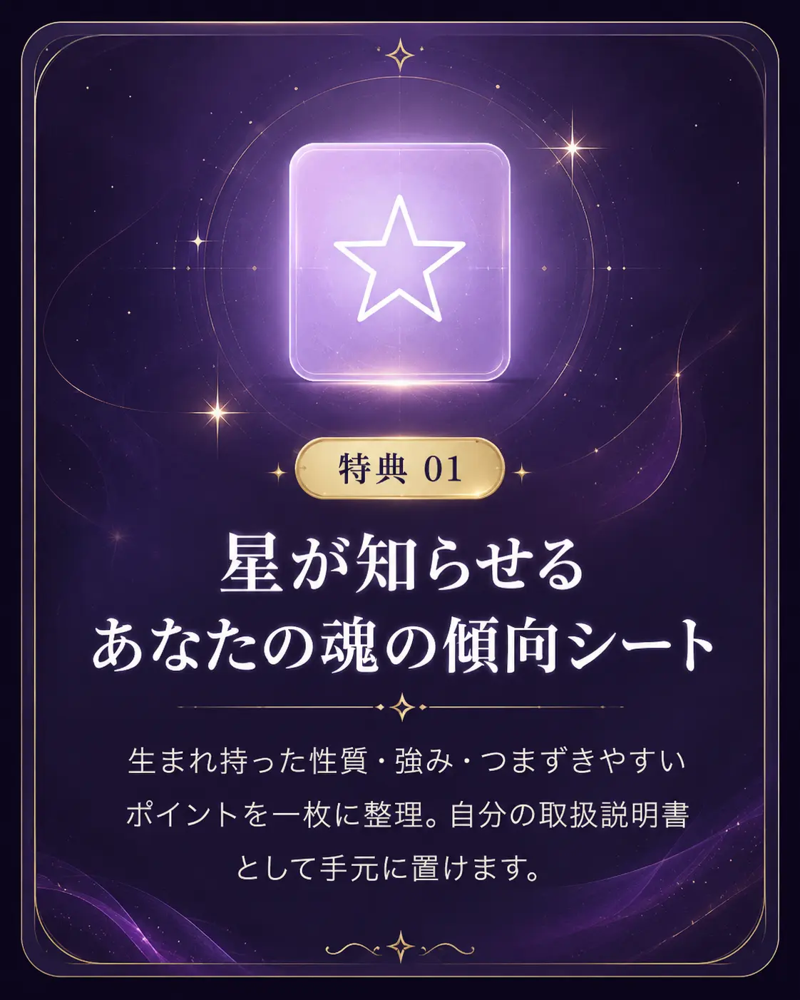

# トンマナ仕様（画像制作用）

しあわせ超開運メソッド LP の世界観定義。**ChatGPTで画像を作る際は、この仕様に沿ってください。**

---

## 1. コンセプト

> **夜明け前の星空から、朝の光へ。**

「混沌のなかで迷っている状態（濃紺・夜）」から「自分の設計図を知って進む状態（淡いピンク・朝）」への
グラデーションが、このLPの縦軸です。ページを下にスクロールするほど明るくなります。

| 軸 | 方向性 |
|---|---|
| **合っている** | 静謐・上品・余白がある・光がやわらかい・大人の女性向け |
| **合っていない** | 派手・ギラギラ・原色・情報過多・若年層向け・いかにも「占い」 |

既存LPは彩度が高く要素が密でしたが、**改善版は「引き算」の方向**です。
高単価のバックエンド商品につなげるため、価格に見合う品格を出します。

---

## 2. カラーパレット

**この6色以外は使わないでください。** 画像もこの範囲に収めると、ページ全体が1つの作品に見えます。

| 役割 | HEX | 使いどころ |
|---|---|---|
| 濃紫紺（ベース） | `#1B1233` | 夜空・背景の最も濃い部分 |
| 深紫 | `#3B2668` | 中間の暗部 |
| 藤紫 | `#8B6BC7` | 光の中間色 |
| 淡ピンク | `#E39BC2` | 朝の光・やわらかさ |
| 薄桜 | `#F7DCEB` | 最も明るい部分・余白 |
| ゴールド | `#C0983F` | 星・アクセント（**面積は5%以下**） |

### 配色ルール

- **1枚の画像に濃紫紺と薄桜を必ず両方入れる**（コントラストが世界観の核）
- ゴールドは「星ひとつ」「細い線」程度に留める。金を広く使うと安っぽくなります
- 水色・緑・オレンジ・赤は**使わない**

---

## 3. 画像の作法

### OK

- 抽象的な光・星・宇宙・グラデーション
- シルエット（人物の顔が判別できない後ろ姿・横顔の影）
- 自然物（花びら・水面・雲・光の粒）を抽象化したもの
- 中央に余白があり、文字を乗せられる構図

### NG

- **画像内に文字を入れない**（HTML側で文字を乗せます。画像内文字は拡大でボケる・修正できない）
- 人物の顔がはっきり写ったAI生成画像（不自然さが信頼を損ないます）
- 十字架・五芒星・タロット・水晶玉など、特定の宗教・占術を強く連想させるもの
- 効果を断定する表現（「必ず叶う」等）を想起させるビジュアル
- フリー素材にありがちな「笑顔の外国人女性」

---

## 4. 必要な画像リスト

| # | 用途 | ファイル名 | サイズ | 優先度 |
|---|---|---|---|---|
| 1 | 特典1ビジュアル | `images/gift-01.webp` | 800×800 | **高** |
| 2 | 特典2ビジュアル | `images/gift-02.webp` | 800×800 | **高** |
| 3 | 特典3ビジュアル | `images/gift-03.webp` | 800×800 | **高** |
| 4 | プロフィール写真 | `images/aki.jpg` | 800×800 | **高**（※実写。AI生成不可） |
| 5 | OGP画像（SNSシェア用） | `images/ogp.jpg` | 1200×630 | 中 |
| 6 | FV背景テクスチャ | `images/hero-bg.webp` | 1600×2000 | 低（現状CSSで代替済み） |

現在 1〜3 はCSSグラデーション＋線画アイコンで仮組みしています。**このままでも成立します**ので、
画像に差し替えるかどうかは見比べてから決めて構いません。

---

## 5. ChatGPT用プロンプト（コピペ可）

> **コツ：4枚とも同じチャット内で連続生成してください。** 2枚目以降に
> 「前の画像と同じ画風・同じ配色で」と添えると、トンマナが揃います。

### 共通の下地（毎回この文を先頭に付ける）

```
Style: ethereal celestial abstract art, soft painterly gradients, refined and calm,
luxury spiritual aesthetic for adult women. Color palette strictly limited to:
deep indigo #1B1233, deep violet #3B2668, wisteria #8B6BC7, soft pink #E39BC2,
pale blush #F7DCEB, and a small amount of gold #C0983F (under 5% of the area).
Dark indigo and pale blush must both appear. Soft diffused light, fine film grain,
generous negative space in the center.
No text, no letters, no numbers, no watermark, no logos.
No human faces. No religious or occult symbols (no cross, pentagram, tarot, crystal ball).
Not oversaturated, not neon, no rainbow colors.
Square format 1:1.
```

### 特典1（魂の傾向シート）

```
[共通の下地をここに貼る]

Subject: a single luminous star at the center of a deep indigo night sky,
with faint constellation lines radiating softly outward like a blueprint.
The lower area transitions gently into pale blush dawn light.
Quiet, precise, contemplative.
```

### 特典2（願いが叶うまでのロードマップ）

```
[共通の下地をここに貼る]

Subject: a soft glowing path or ribbon of light curving from the lower-left
darkness toward the upper-right where the sky brightens into pale blush.
Small points of light mark stages along the path.
A sense of journey and forward movement.
```

### 特典3（開運ヒーリング動画）

```
[共通の下地をここに貼る]

Subject: gentle concentric ripples on a still water surface, seen from above,
reflecting a violet-to-blush gradient sky. A few soft petals float on the surface.
Extremely calm, meditative, healing. Almost monochromatic within the palette.
```

### OGP画像（1200×630・横長）

```
[共通の下地をここに貼る／ただし最後の "Square format 1:1." を
 "Wide landscape format 1200x630, with the left half kept simple and empty
  so that text can be placed there." に差し替える]

Subject: a wide night sky gradient from deep indigo on the left to pale blush
dawn on the right, with a scattering of small stars and one brighter golden star.
```

---

## 6. 書き出しと設置

### 書き出し

1. ChatGPTから **PNG** でダウンロード
2. https://squoosh.app/ で **WebP・品質80** に変換（`.webp` で保存）
3. **1枚あたり150KB以下**を目安に。重い画像はスマホの表示速度を落とし、離脱に直結します

※ プロフィール写真だけは `.jpg` のままで構いません。

### 設置

1. リポジトリ直下に `images` フォルダを作る
2. 上表のファイル名で画像を入れる
3. `index.html` の該当箇所を差し替え（下記）

**特典画像の差し替え**（745 / 758 / 772行目。`gift-visual` で検索）

```html
<!-- 変更前 -->
<div class="gift-visual g1">
  <svg viewBox="0 0 24 24" ...>...</svg>
</div>

<!-- 変更後 -->
<div class="gift-visual">
  
</div>
```

CSSに追記（389行目 `.gift-visual svg{...}` の下）

```css
.gift-visual img{width:100%;height:100%;object-fit:cover;border-radius:12px}
```

**OGP画像の設定**（`<head>` 内、10行目あたりに追記）

```html
<meta property="og:title" content="しあわせ超開運メソッド 無料動画セミナー">
<meta property="og:description" content="生まれた瞬間の星が示す、あなただけの魂の設計図。">
<meta property="og:image" content="https://810eigo-droid.github.io/AKI-MAKARA/images/ogp.jpg">
<meta property="og:type" content="website">
<meta name="twitter:card" content="summary_large_image">
```

---

## 7. タイポグラフィ（参考・変更不要）

| 用途 | フォント | 理由 |
|---|---|---|
| 見出し | Noto Serif JP 900 | 明朝の縦線が「品格」を出す |
| 本文 | Noto Sans JP 400 | 長文でも読み疲れしない |
| 英字装飾 | Cormorant Garamond Italic | `Gift` `Profile` などの小見出し |

画像に文字を入れないのは、このフォント体系を崩さないためでもあります。
